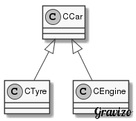

# 第18讲 成员对象和封闭类

> 这是一个很直观的面向对象的概念。  
> 视频地址: [https://www.coursera.org/learn/cpp-chengxu-sheji/lecture/5g26f/cheng-yuan-dui-xiang-he-feng-bi-lei-de-gai-nian](https://www.coursera.org/learn/cpp-chengxu-sheji/lecture/5g26f/cheng-yuan-dui-xiang-he-feng-bi-lei-de-gai-nian)

类成员是某个类的对象，即为「成员对象」，这个类就称为「封闭类」。

* 成员对象：一个类的成员变量是另一个类的对象。  
* 包含成员对象的类叫封闭类\(Enclosing\)  

封闭类的对象生成时：

* 先执行所有成员函数的构造对象
* 再执行封闭类的构造函数

成员对象的构造函数调用顺序：

* 和成员对象在类中的说明顺序一致
* 与在成员初始化列表中出现的顺序无关

当封闭类消亡时：

* 先执行封闭类的析构函数
* 再执行成员对象的析构函数

  （同样满足「先构造后析构，后构造先析构」）

代码示例：  
  
\([CCar.cpp](https://github.com/iridiumcao/cpp-note/tree/880e117845a17eb6c60956118ca4255ee37bb412/code/ch18/CCar.cpp), [CEngine.cpp](https://github.com/iridiumcao/cpp-note/tree/880e117845a17eb6c60956118ca4255ee37bb412/code/ch18/CEngine.cpp), [CTyre.cpp](https://github.com/iridiumcao/cpp-note/tree/880e117845a17eb6c60956118ca4255ee37bb412/code/ch18/CTyre.cpp)\)

```cpp
class CTyre {
    int radius;
    int width;
    public:
    CTyre(int r, int w):radius(r), width(w){}
};

//////////////

class CEngine {};

/////////////

class CCar {
  int price;
  CTyre tyre;
  CEngine engine;

public:
  CCar(int p, int tr, int tw);
};

CCar::CCar(int p, int tr, int tw) : price(p), tyre(tr, tw) {}

int main() {
  CCar car(20000, 17, 225);
  return 0;
}
```

---

[\<Previous](ch-17-static-members.md) \| [Home](SUMMARY.md) \| [Next\>](ch-19-friend.md)