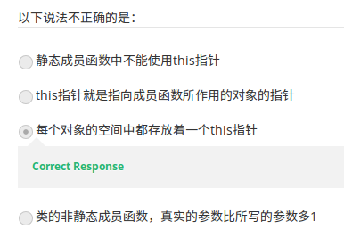

# 第20讲 this 指针

> Java 中也有 this 这个关键字，也可以有类似的理解。  
> 视频地址：[https://www.coursera.org/learn/cpp-chengxu-sheji/lecture/eVMPQ/thiszhi-zhen](https://www.coursera.org/learn/cpp-chengxu-sheji/lecture/eVMPQ/thiszhi-zhen) 视频中从 C++ 程序到 C 程序的翻译讲起，很有意思。

`this` 指针，是这样一种指针：它指向成员函数所作用的对象。这点和 Java 是类似的，不同的是，在 C++ 中，`this` 需要用指针访问符号 `->` 连接成员而 Java 中用点号 `.` 即可。

* 只能在非静态成员函数中使用，如构造器或普通的非静态成员函数。
* 静态成员函数中不能使用 `this` 指针，因为静态成员函数不作用于某个对象。

## C++ 翻译为 C

C++ 诞生时，并没有 C++ 编译器，那时是把 C++ 程序翻译为 C 程序再编译的。事实上，所有的 C++ 程序都是可以翻译成 C 程序的。 具体翻译简单地可以这么理解：类转化为结构体和全局函数。 例如：

```cpp
class CCar {
public:
  int price;
  void setPrice(int p);
};

void CCar::setPrice(int p) { price = p; }

int main() {
  CCar car;
  car.setPrice(200000);
  return 0;
}
```

翻译为

```c
struct CCar {
  int price;
};

void setPrice(struct CCar *this, int p) { this->price = p; }

int main() {
  struct CCar car;
  setPrice(&car, 200000);
  return 0;
}
```

\(代码下载：[CCar.cpp](https://github.com/iridiumcao/cpp-note/tree/880e117845a17eb6c60956118ca4255ee37bb412/code/ch20/CCar.cpp), [CCar.c](https://github.com/iridiumcao/cpp-note/tree/880e117845a17eb6c60956118ca4255ee37bb412/code/ch20/CCar.c)\)  
以上代码可以看出对应类有一个同名的结构体，其中的域就是类的成员变量；而成员函数被转成了全局函数，但入口参数增加了 `this` 指针，指向结构体。这就是 `this` 指针本质来源。  
以上是郭老师在视频中举出的例子，这就是 C++ `this` 指针的原理。

## 通过对象指针调用成员函数的另一个例子

关于对象指针调用成员函数会转成全局函数，而且全局函数会增加一个参数，下面还有一个例子：

```cpp
class A {
public:
  void hello() { cout << "hello" << endl; }
};

int main() {
  A *p = NULL;
  p->hello();
}
```

\([代码下载](https://github.com/iridiumcao/cpp-note/tree/880e117845a17eb6c60956118ca4255ee37bb412/code/ch20/A.cpp)\)  
如果是 Java，这么写肯定报错了，null pointer，但是 C++ 不会，为什么？因为 `p->hello()` 实际上被翻译成 `hello(p)` 这个全局函数了， 就算 `p` 是 `NULL` 也无妨，`hello()` 函数里只有一条打印语句，这条语句也不用调用当前对象，所以以上程序会输出：

```text
hello
```

但是，如果对类 `A` 稍做修改，增加一个成员变量，并在 `hello()` 中调用，修改后代码如下：

```cpp
class A2 {
  int i;

public:
  void hello() { cout << i << ", hello" << endl; }
};

int main() {
  A2 *p = NULL;
  p->hello();
}
```

\([代码下载](https://github.com/iridiumcao/cpp-note/tree/880e117845a17eb6c60956118ca4255ee37bb412/code/ch20/A2.cpp)\)  
以上代码可以通过编译，但不能正常运行。原因是 `hello()` 转成全局函数：

```c
void hello(A2 * this) {
    cout << this->i << ", hello" << endl;
}
```

`this` 指向 `NULL`, 无法访问到 `i`, 故报错。

最后附上视频中的一道测试：  


