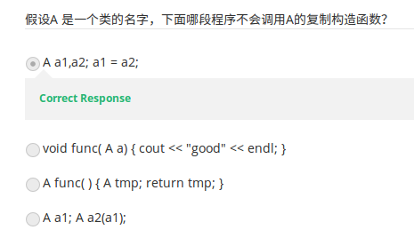

# 第14讲 复制构造函数(Copy Constructor)

> 注意这里的「复制」不是动词。本节 Java 用户需要特别注意。  
> 视频地址：<https://www.coursera.org/learn/cpp-chengxu-sheji/lecture/P1ssX/fu-zhi-gou-zao-han-shu>

## 基本概念
* 只有一个参数：即对同类对象的引用。  
形如
``` C++
    X::X(X&);
    // or 
    X::X(const X&);
```
* 如果没有定义复制构造函数，则编译器会生成默认复制构造函数，完成复制功能。
假定有一个类 Complex，它使用默认构造函数：
``` C++
class Complex {
    double real;
    double imag;
    public:
        ......
};
```
下面的调用方式将使用复制构造函数：
``` C++
Complex c1;     // 调用默认无参构造函数
Complex c2(c1); // 调用复制构造函数，将 c2 初始化成和 c1 一样
```
和默认构造函数类似，如果自定了复制构造函数，则编译器不再生成默认的构造函数。自定义的复制构造函数甚至可以不做复制的工作，虽然这可能是一种不好的实践。

* 不允许有形如 ``X::X(X)`` 的构造函数
``` C++
class Nono {
    Nono(Nono n); // ！错，不允许定义这种形式的构造函数
};
```
这个限制虽然 Java 没有，但如果在编写 Java 类中这样写，仍然是不好的实践。

## 复制构造函数的作用
* 用一个对象去初始化同类的另一个对象。
``` C++
Complex c2(c1);
Complex c2 = c1; // !这是一条初始化语句，并非赋值语句！
```
以上两条语句是等价的，都是用对象 c1 去初始化对象 c2。特别需要注意第二句，它不是赋值语句。它和下面的语句并不等价：
``` C++
Complex c2;
c2 = c1;
```
**注意**!!! 惯用 Java 的话，这里几乎肯定会是一个坑。

* 如果某函数有一个参数类``A``的对象，那么该函数被调用时，类``A``的复制构造函数会被调用。
``` C++
class A {
public:
  A(){}; // 这里这个无参构造函数也必须写上，否则 A a 不能正常生成对象
  A(A &a);
};

A::A(A &a) { cout << "Copy constructor called." << endl; }

//空函数
void func(A a) { // 参数类型是 A.
}

int main() {
  A a;
  func(a); // 输出 "Copy constructor called."
  return 0;
}
```
([代码下载](code/ch14/A.cpp))  

* 如果函数的返回值是类``A``的对象时，则函数返回时，``A``的复制构造函数会被调用。

视频中的随堂问题很有意思：  
  
原因如前面所述。

## 为什么需要复制构造函数？
TO BE CONTINUED...

