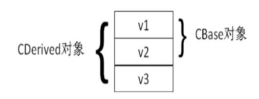

# 第25讲 继承和派生

> **继承**是面向对象语言的基本功能.

## 1. 初识继承和派生

> 视频地址：<https://www.coursera.org/learn/cpp-chengxu-sheji/lecture/HLyL0/ji-cheng-he-pai-sheng>

派生类拥有基类的全部成员函数和成员变量，不论是 ``private``, ``protected``, ``public``. 
但在派生类中，不能直接访问基类的 ``private`` 成员。

语法和 Java 有区别。在 Java 中，通常以**扩展**来表示继承关系，关键字是 ``extends``. 另外一个比较重大的区别是：Java 是单继承，而 C++ 是多继承。但多继承太复杂了，在实际的开发工作中应该尽量少用。

``派生类对象的体积 = 基类对象的体积 + 派生类对象自己的成员变量的体积``

派生类对象包含基类对象，基类对象的存储位置位于派生类对象新增的成员变量之前

``` C++
class CBase {
  int v1, v2;
};

class CDerived : public CBase {
  int v3;
};
```


本节虽然是 OO 中非常基础和重要的内容，但因为和 Java 基本上一致，没什么新东西，除了语法上的区别，不再赘述。

## 2. 复合关系和继承关系

> 视频地址：<https://www.coursera.org/learn/cpp-chengxu-sheji/lecture/4LHxO/fu-he-guan-xi-he-ji-cheng-guan-xi>

两个对象可以有这些关系：
* 没有关系
* 继承关系 is-a. 设有基类 A，B 是基类 A 的派生类，则逻辑上要求满足：一个 B 的对象也是一个 A 的对象。
* 复合关系 has-a. 类 C 中有成员变量 k, k 是类 D 的对象，则 C 和 D 是复合关系。一般逻辑上要求：D 对象是 C 对象的固有属性或组成部分。

## 3. 基类/派生类同名成员和 protected 访问范围说明符

> 视频地址：<https://www.coursera.org/learn/cpp-chengxu-sheji/lecture/ox1Op/ji-lei-pai-sheng-lei-tong-ming-cheng-yuan-he-protectedfang-wen-fan-wei-shuo-ming>

这一节讲的是派生类的成员对基类的 override 问题。

基类的 private 成员只能被基类的成员函数和友元函数访问。
基类的 protected 成员，可以被基类的成员函数和友元函数访问，还可以被派生类的成员函数函数。
这里需要特别注意的是，派生类的成员函数中只能访问当前类的基类的 protected 成员。
这种是不能访问的：
TODO
class Base {
  int nProtected;
};

class Derivd : public Base {
  void hello();
};

Derivd::hello() {
  nProtected = 1; // OK
  Derivd d2;
  d2.nProtected = 2; // WRONG
}

## 4. 派生类的构造函数

> 视频地址：<https://www.coursera.org/learn/cpp-chengxu-sheji/lecture/LMbxe/pai-sheng-lei-de-gou-zao-han-shu>

