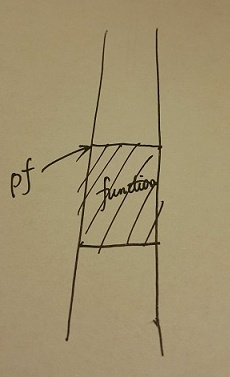

# 第01讲 函数指针

> 按：本讲实际上是对 C 语言部分高级特性的一个回顾。开篇就讲函数指针，这点相对于其他 C++ 教程还是有比较大的差别的，这也反应出 FP \(Functional Programming, 函数式编程\) 日渐强势。  
> 视频地址：[https://www.coursera.org/learn/cpp-chengxu-sheji/lecture/8lQv8/han-shu-zhi-zhen](https://www.coursera.org/learn/cpp-chengxu-sheji/lecture/8lQv8/han-shu-zhi-zhen)

## 1.1 基本定义

程序在运行期间，每个函数都会占用一段连续的内存空间。函数名即为该函数所在内存区域的起始地址（入口地址）。这个入口地址可以赋给指针变量，使该指针指向该函数。这种指向函数的指针变量即为**函数指针**。



**定义形式**

```c
类型名 (*指针变量名)(类型参数1，类型参数2, ...)
```

e.g.:

```c
int (*pf)(int, char);
```

pf 就是函数指针，这个函数返回值是 int, 两个参数的类型分别为 int 和 char.

下面是一个完整可用的例子：

```cpp
#include <iostream>

using namespace std;

int sum(int a, int b) {
    return a + b;
}

int main() {
    int (*pf)(int, int); // 定义函数指针
    pf = sum; // pf 指向 sum 函数
    cout << pf(3, 2) << endl;
    return 0;
}
```

\([代码下载](https://github.com/iridiumcao/cpp-note/tree/880e117845a17eb6c60956118ca4255ee37bb412/code/ch01/ch01.1.cpp)\)

## 1.2 库函数中的应用——快速排序函数

排序，简单讲就是不断比较并交换位置的过程。函数指针在排序函数中也有应用，需要用到指向用户自定义的排序规则函数的指针。

### 1.2.1 C 语言表达

在视频讲座中，郭老师给出的例子是 C 语言的。本示例通过调用 ``qsort`` 函数，对 ``unsigned int`` 数组进行排序。

```c
/*
 * base: 数组的起始地址
 * nelem: the number of elements, 数组元素的个数，即待排序的元素个数
 * width: the size of each element, 每个元素的大小，结合前面的参数，可以计算出每个元素的地址
 * pfCompare: 定义排序依据的函数，这个函数是用户定义的
 */
void qsort(void *base, int nelem, unsigned int width, int (*pfCompare)(const void *, const void *));
```

以上，`qsort` 函数在执行时会通过 `pfCompare` 指针调用「比较函数」调用时将两个要比较的元素的地址传给「比较函数」，然后根据「比较函数」的返回值（「比较函数」的执行结果），决定谁先谁後。

下面是一个完整可用的例子：

```c
#include <stdio.h>
#include <stdlib.h>

#define NUM 5

/*
 * 比较函数的编写规则：
 * 1. 如果要让 *elem1 排在 *elem2 之前，则返回值是负整数
 * 2. 如果 *elem1 和 *elem2 谁前谁後皆可，即两元素相等，则返回零
 * 3. 如果要让 *elem1 排在 *elem2 之後，则返回值是正整数
 */
int myCompare(const void * elem1, const void *elem2) {
    unsigned int *p1, *p2;
    p1 = (unsigned int *) elem1; //! 这里必须使用 cast 得到实际的类型
    p2 = (unsigned int *) elem2;
    return *p1 - *p2; //本例执行结果：4 8 10 11 123 
    //如果返回语句这样：
    //return (*p1 % 10) - (*p2 % 10);
    //那么程序执行的结果将是：10 11 123 4 8，程序的排序依据是各数对10的模，即个数的大小。
}

int main() {
    unsigned int array[NUM] = {8, 123, 11, 10, 4};
    qsort(array, NUM, sizeof(unsigned int), myCompare);
    for(int i = 0; i < NUM; i++) {
        printf("%d ", array[i]);
    }

    return 0;
}
```

\([代码下载](https://github.com/iridiumcao/cpp-note/tree/880e117845a17eb6c60956118ca4255ee37bb412/code/ch01/ch01.2.c)\)  
从使用 Java 的经验看，以上代码中必须使用 `cast` 看起来是比较丑陋的，但 C 就是 C，用 Java 的视角去评判也许不合适。

### 1.2.2 C++ 语言表达

鉴于本课程是关于 C++ 的，下面给出 C++ 版本的表达，看起来比 C 要简单一些。

在 C++ 中，需要调用 algorithm 库中的 sort 模板函数\([Ref](http://www.cplusplus.com/reference/algorithm/sort/)\)，说明如下：

```cpp
// first: 第一个元素的地址
// last: 最后一个元素的地址
// comp: 自定义比较函数
bool sort(first, last, comp)
```

下面是一个完整可用的例子：

```cpp
#include <iostream>
#include<algorithm>

using namespace std;

const unsigned int NUM = 5;

// 这里定义 a 在 b 前的条件，比较小的排在前面
// 所以这里定义的是从小到大的排列顺序
bool compare(int a, int b) {
    return a < b;
}

int main() {
    unsigned int array[NUM] = {8, 123, 11, 10, 4};
    sort(array, array + NUM, compare);
    for(int i = 0; i < NUM; i++) {
        cout << array[i] << " "; //本例执行结果：4 8 10 11 123 
    }

    return 0;
}
```

\([代码下载](https://github.com/iridiumcao/cpp-note/tree/880e117845a17eb6c60956118ca4255ee37bb412/code/ch01/ch01.3.cpp)\)  
很明显，C++ 的排序函数相对于 C 有很大的简化，也更好用。

